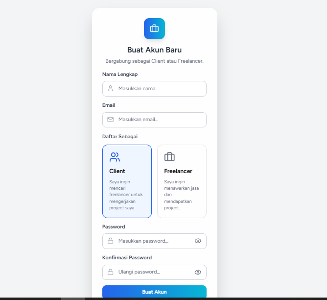
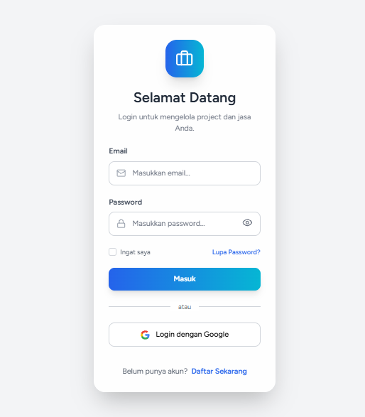
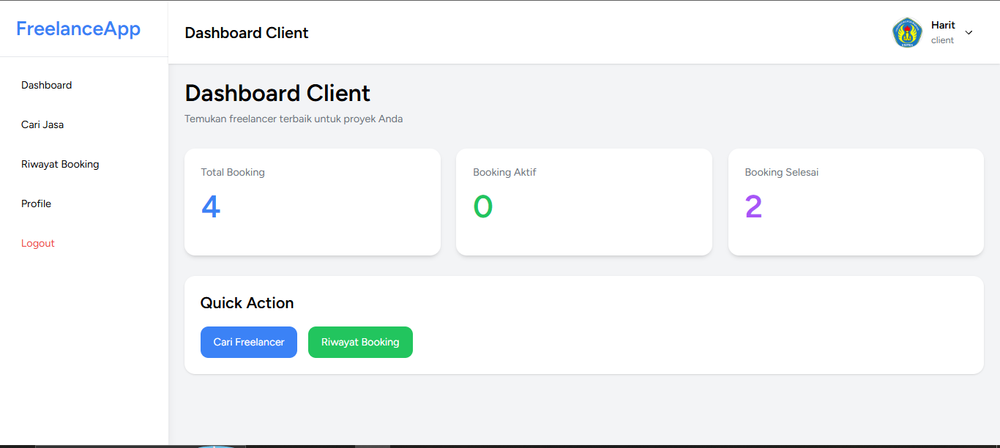
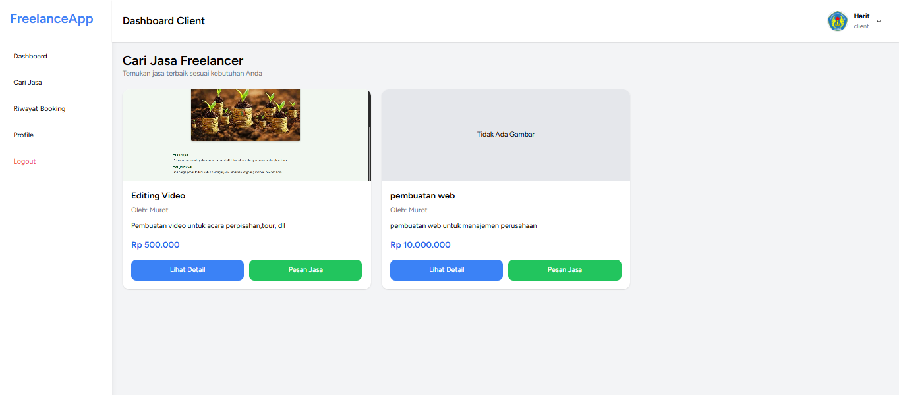
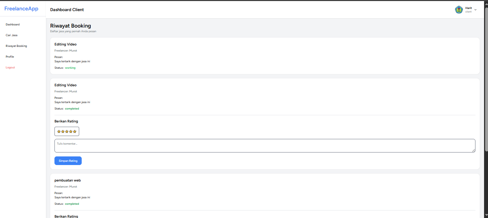
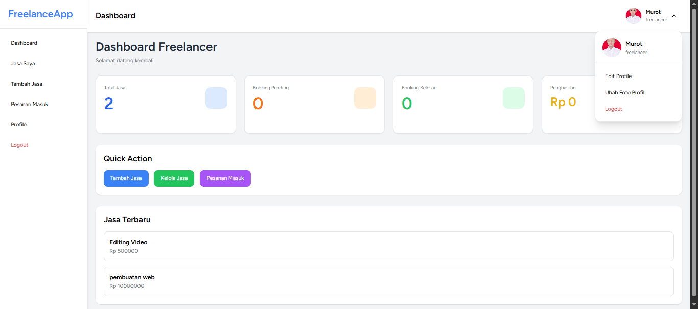
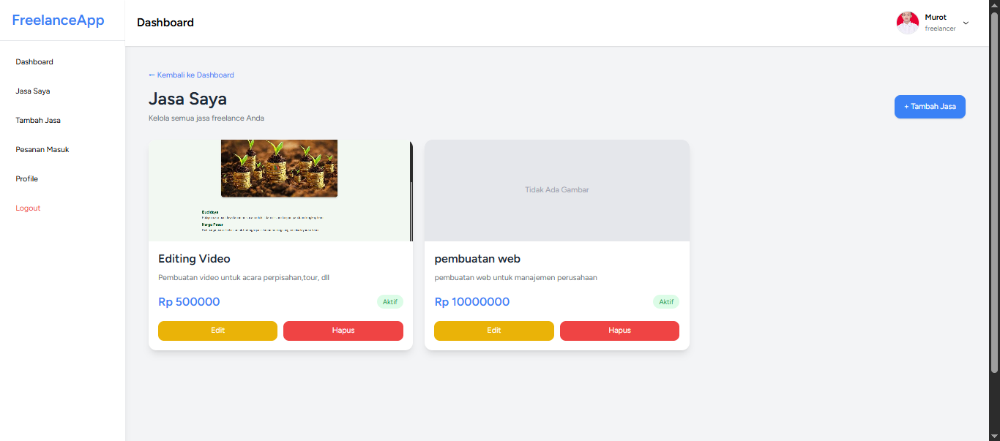
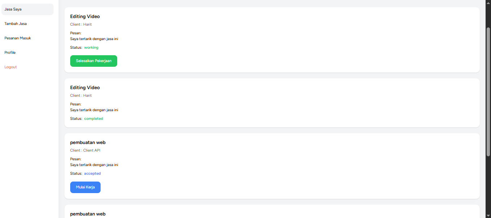

# FreelanceApp Marketplace

FreelanceApp Marketplace merupakan aplikasi berbasis web yang menghubungkan **Client** dengan **Freelancer** dalam satu platform. Client dapat mencari jasa freelancer, melakukan booking, memberikan rating, sedangkan Freelancer dapat mengelola jasa, menerima pesanan, serta memantau dashboard secara real-time.

---

# Bahasa Pemrograman

- PHP 8.2
- TypeScript
- JavaScript
- HTML5
- CSS3

---

# Framework, Library, API

## Backend

- Laravel 12
- Inertia.js
- MySQL
- Eloquent ORM

## Frontend

- React.js
- TypeScript
- Tailwind CSS
- Vite

## Library

- Lucide React
- AOS (Animate On Scroll)
- Axios
- Ziggy

## API
- Laravel REST API (`routes/api.php`)
  Digunakan untuk:
    - Pengambilan data (GET)
    - Pengiriman data (POST)
    - Update data (PUT/PATCH)
    - Hapus data (DELETE)
- Laravel Web Routes (`routes/web.php`)
  Digunakan untuk:
    - Landing Page
    - Login & Register
    - Dashboard Client
    - Dashboard Freelancer
    - Manajemen Jasa
    - Booking
    - Profile
    - Axios sebagai HTTP Client untuk komunikasi Frontend dan Backend

---

# Fitur Proyek

## Landing Page

- Hero Section Modern
- Navbar Responsive
- Search Jasa
- Kategori Populer
- Jasa Terbaru
- CTA (Call To Action)
- Footer

---

## Authentication

- Login
- Register
- Logout
- Role Client
- Role Freelancer

---

## Freelancer

- Dashboard Freelancer
- Statistik Dashboard
- CRUD Jasa
- Upload Gambar Jasa
- Profil Freelancer
- Pesanan Masuk
- Kelola Booking
- Terima Booking
- Tolak Booking
- Mulai Pengerjaan
- Selesaikan Booking

---

## Client

- Dashboard Client
- Cari Freelancer
- Detail Jasa
- Booking Freelancer
- Riwayat Booking
- Memberikan Rating Freelancer

---

## Sistem

- Upload Image
- Session Authentication
- Middleware Authentication
- Middleware Role
- Responsive Layout
- Modern UI

---

# Kelebihan Proyek

- Menggunakan Laravel 12 terbaru
- Menggunakan React + Inertia sehingga SPA tanpa API terpisah
- Dashboard Client dan Freelancer terpisah
- UI Modern menggunakan Tailwind CSS
- Responsive pada Desktop dan Mobile
- CRUD Jasa lengkap
- Upload gambar jasa
- Sistem Booking
- Sistem Rating
- Mudah dikembangkan menjadi marketplace profesional

---

# Kekurangan Proyek (Bug / Warning)

Beberapa fitur yang masih dapat dikembangkan:

- Belum tersedia pembayaran online (Payment Gateway)
- Belum terdapat fitur Chat antara Client dan Freelancer
- Belum terdapat Notifikasi Real-Time
- Belum terdapat fitur Favorite Freelancer
- Belum terdapat Dashboard Admin
- Belum terdapat pencarian menggunakan filter kategori dan harga
- Belum terdapat pagination pada daftar jasa
- Penghasilan freelancer masih berupa data statis

---

# Cara Menjalankan Project

Clone repository

```bash
git clone (https://github.com/Harit28/freelanceapp.git)
```

Masuk folder project

```bash
cd jasa-freelance
```

Install dependency

```bash
composer install

npm install
```

Copy environment

```bash
cp .env.example .env
```

Generate key

```bash
php artisan key:generate
```

Migrasi database

```bash
php artisan migrate
```

Storage Link

```bash
php artisan storage:link
```

Jalankan project

```bash
php artisan serve

npm run dev
```

---

# Struktur Project

```
app/
resources/
routes/
database/
public/
storage/
```

---

# Dokumentasi Proyek

## Landing Page


---

## Form Register



---

## Form Login



---

## Dashboard Client



---

## Client Cari Jasa



---

## Riwayat Booking Client



---

## Dashboard Freelancer



---

## Jasa Freelancer



---

## Pesanan Masuk Freelancer



---

